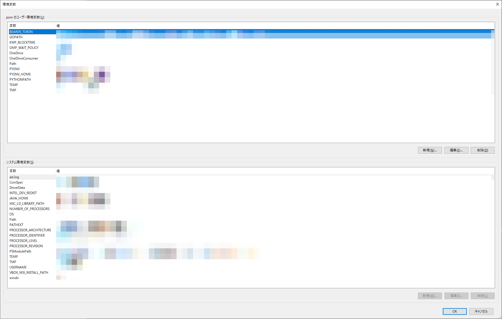

# FileSharer_via_GigaFileDelivery_Windows
ファイルをGoogle Chrome経由でギガファイル便にアップロードして、ダウンロードURLを自動的に返してくれるサービス。  
ファイルを右クリックするとコンテキストメニューの「送る」からアップロードしてくれます。  

## できないこと
・一度に複数のファイルをアップロードし、複数のファイルのダウンロードURLをクリップボードにコピーする  
・一度に複数のファイルをアップロードし、ひとつにまとめられたZipファイルのダウンロードURLをクリップボードにコピーする  
・削除キーの取得  
・ファイル保持期間変更（デフォルトでは5日）  

## 実行推奨環境
・Windows10 以上  
・Visual Studio Code 1.83.1 以上  
・git 2.40.0 以上  
・Python 3.10.5 以上  
・Poetry 1.6.1 以上  
・pyenv 3.1.1 以上  

## 環境構築のための準備
__ここでは基本的なことしか述べていないので、わかる人は「環境構築」まで読み飛ばしても構いません。__
1. Viaual Studio Codeのインストール  
   下記URLよりインストーラーをダウンロードして、インストールを実行してください。  
   https://code.visualstudio.com/download
2. Pythonのバージョン確認  
   コマンドプロンプトを開いて下記コマンドを実行してください。  
   ```
   python --version
   ```
   下記のように表示されれば正常にインストールされているので、3及び4はスキップして構いません。  
   （ぶっちゃけバージョンはPython3であればたぶん動くと思うので、なんでもいいです。）  
   ```
   python 3.10.5
   ```
   もし、Pythonがインストールされていなければ下記コマンドのようになるので、Pythonをインストールするために3及び4に進みましょう。
   ```
   command not found: python
   ```
3. （pyenvのインストール）  
   ターミナルを開いて下記コマンドを実行してください。
   ```
   pip install pyenv-win --target $HOME\\.pyenv
   ```
   PYENVを環境変数に追加するために下記コマンドを実行してください。
   ```
   [System.Environment]::SetEnvironmentVariable('PYENV',$env:USERPROFILE + "\.pyenv\pyenv-win\","User")
   ```
   同じく、PYENV_HOMEを環境変数に追加するために下記コマンドも実行してください。
   ```
   [System.Environment]::SetEnvironmentVariable('PYENV_HOME',$env:USERPROFILE + "\.pyenv\pyenv-win\","User")
   ```
   最後に、pyenvコマンドにアクセスできるようにするために、下記コマンドを実行します。
   ```
   [System.Environment]::SetEnvironmentVariable('path', $env:USERPROFILE + "\.pyenv\pyenv-win\bin;" + $env:USERPROFILE + "\.pyenv\pyenv-win\shims;" + [System.Environment]::GetEnvironmentVariable('path', "User"),"User")
   ```
   ここで一度コマンドプロンプトを再起動しましょう。  
   下記コマンドを実行してpyenvがインストールできているか確認しましょう。
   ```
   pyenv --version
   ```
   ついでに、Pyenvのshimsを再構成するために、下記コマンドを実行します。
   ```
   pyenv rehash
   ```
4. （Pythonのインストール）  
   ターミナルを開いて下記コマンドを実行してください。
   ```
   pyenv install --list
   ```
   下記のようにインストールできるPythonバージョンのリストが一覧表示されます。
   ```
   2.1.3
   2.2.3
   2.3.7
   …
   （中略）
   …
   3.11.5
   3.11.6
   3.12.0
   ```
   今回は3.10.5をインストールしようと思います。
   ターミナルにて下記コマンドを実行してください。
   ```
   pyenv install 3.10.5
   ```
5. Gitのインストール  
   ターミナルを開いて下記コマンドを実行してください。
   ```
   git --version
   ```
   バージョンが表示されれば無事インストールされているのでこの工程はスキップして構いません。  
   エラー表示が出れば、未インストールなので下記URLを参考にしてgitをインストールしましょう。  
   https://qiita.com/T-H9703EnAc/items/4fbe6593d42f9a844b1c  
   もう一度下記コマンドを実行してバージョン情報が表示されたらインストール完了です。
   ```
   git --version
   ```
6. Poetryのインストール  
   Poetryはたぶんデフォルトではインストールされていないと思うのでターミナルにて下記コマンドを実行しましょう。
   ```
   (Invoke-WebRequest -Uri https://install.python-poetry.org -UseBasicParsing).Content | py -
   ```
   次にスタート画面にて「環境変数を編集」と入力するとアプリが立ち上がります。
     
   下画面のユーザー環境変数に注目。変数名Pathを選択した上で、編集をクリック
     
   出現したウインドウの「新規」をクリックし、下記の変数値を代入してください。
   ```
   %APPDATA%\Python\Scripts
   ```
   上記を保存した後、コマンドプロンプトを再起動してください。  
   ターミナルにて下記コマンドを実行して正常にバージョン情報が表示されたらインストール完了です。
   ```
   poetry --version
   ```
   最後にPoetryの設定を変更しておきましょう。
   ```
   poetry config virtualenvs.in-project true
   ```
   これで作業ディレクトリ内に.venvファイルを生成することができるようになります。
7. GitHubアカウントの登録  
   下記URLにてGitHubアカウントを登録してください。  
   https://github.co.jp

   このままではまだGitでの操作はできません。ターミナルにて下記コマンドを実行しましょう。
   ```
   cd ~/.ssh
   ```
   ```
   ssh-keygen -t rsa
   ```
   すると、下記のような３つの質問をされます。何も入力せずに３回Return(Enter)キーを押しましょう。  
   （your_user_nameのところはご自身のPCの名前で表示されるはずです。）
   ```
   Generating public/private rsa key pair.
   Enter file in which tosave the key (/Users/your_user_name/.ssh/id_rsa):
   Enter passphrase (empty for no passphrase):
   Enter same passphrase again:
   ```
   C:\Users\your_user_name\\.sshに移動してみましょう。 （your_user_nameはあなたのPCの名前に置き換えてください。）  
   id_rsa（秘密鍵）とid_rsa.pub（公開鍵）が生成されていることがわかります。  
   id_rsa.pub（公開鍵）をVisual Studio Codeで開いてみましょう。  
   何かしらの暗号のような文字列が一行目に表示されているのがわかります。  
   これを全選択(Ctrl+A)してコピー(Ctrl+C)しましょう。  

   GitHubアカウントに戻ります。  
     
   Dashboardに行くと右上にアカウントアイコンが表示されているのでクリックします。  
   メニューが開くのでSettingsを選択します。  
   左のメニューバーから Access > SSH and GPG keys を選択します。  
   __New SSH key__ をクリックしましょう。  
     
   Titleは何でもいいです。Key typeはAuthentication keyのままで大丈夫です。  
   Keyは先ほどコピーしたid_rsa.pub（公開鍵）の暗号のような文字列をそのままペーストします。  
   最後に __Add SSH key__ をクリックして保存します。  
   すると、新しく鍵マークのSSHが生成されているのがわかります。

## 環境構築
1. git cloneする  
   まずはFileSharerを保存するための適当なディレクトリにあたりをつけてください。  
   今回、筆者はC:\Users\your_user_nameにFileSharer_via_GigaFileDelivery_Windowsを保存します。（your_user_nameはご自身のPCの名前を意味しています。）  
   Visual Studio Codeを開きましょう。ターミナル > 新しいターミナル を選択します。  
   画面下部にターミナルが出現しました。出現したターミナルにて下記コマンドを実行しましょう。（your_user_nameはご自身のPCの名前に置き換えて実行してください。）
   ```
   cd C:\Users\your_user_name
   ```
   先ほどあたりをつけたディレクトリに移動することができました。
   次に下記コマンドを実行してgit cloneしましょう。
   ```
   git clone git@github.com:luculiapon-nktn/FileSharer_via_GigaFileDelivery_Windows.git
   ```
   完了したら確認してみます。  
   git cloneできたことが確認できました。
2. パッケージをインストールする  
   Visual Studio Codeを開きましょう。  
   ファイル > フォルダを開く から先ほど作ったgit cloneしてきたローカルリポジトリを開きましょう。  
   ターミナル > 新しいターミナル で下記コマンドを実行してください。  
   ```
   poetry shell
   ```
   仮想環境の中に入ることができました。また、ローカルリポジトリの中に.venvファイルが生成されていることが確認できます。  
   次にターミナルにて下記コマンドを実行して必要なパッケージをインストールします。
   ```
   poetry install
   ```

## 制御用batファイルを作成する
まず「Windows+R」コマンドを実行して、「shell:sendto」と入力し、Enterを押します。  
SendToフォルダが開きました。この中にbatファイルを作成します。  
SendToフォルダ配下で右クリックをし、「新規作成」から「テキストドキュメント」を選択します。
ファイル名は「FileSharer.txt」としておきましょう。  
ファイルはメモ帳で開くことができるはずです。開いたら下記コマンドを書き込みましょう。  
（your_user_nameはご自身のPCの名前に置き換えて実行してください。）
```
C:
cd C:\Users\your_user_name\FileSharer_via_GigaFileDelivery_Windows\
call .venv\Scripts\activate
python to-gigafile.py %*
```
書き込んだら上書き保存して閉じます。  
最後に拡張子を.batに変更して、FileSharer.batの完成です。  

## 実行
任意のファイルを選択して右クリックしてください。コンテキストメニューの中の「送る」の中に先ほど作成したFileSharer.batが追加されています。  
  
これを実行するとバックグラウンドでWebブラウザにアクセスし、ギガファイル便のダウンロードURLが自動的にクリップボードにコピーされます。  

## Gitの接続を切断
最後にVisual Studio Codeのターミナルでローカルリポジトリを開き、下記コマンドを実行して、Gitとの接続を切断してください。  
```
rm -rf .git/
```
